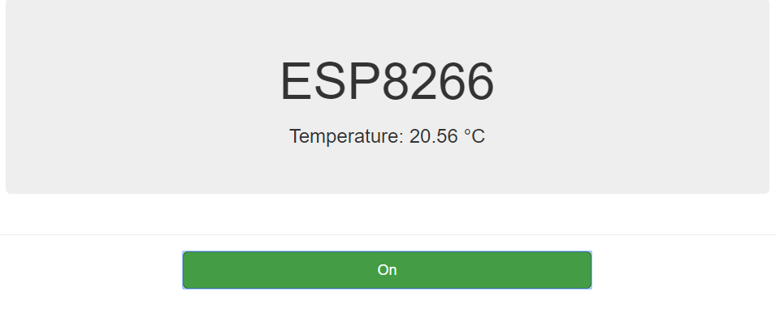
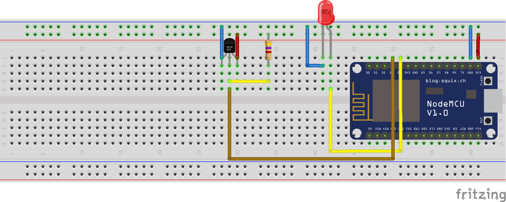

# ESP8266 & ESP32 mit DS18B20 und LED im Schulnetz der MMBBS

# Installation ESP8266
## Voraussetzungen
Folgendes muss installiert sein!
- git
- python
- Arduino IDE
## Vorbereitungen
- Arduino IDE für den ESP8266 konfigurieren, wie hier beschrieben http://randomnerdtutorials.com/how-to-install-esp8266-board-arduino-ide/
- Als Board Node MCU 0.9 (ESP-12 Modul) wählen und richtigen COM Port auswählen
- Library f. DS18B20 installieren, dazu ZIP hier laden (https://github.com/milesburton/Arduino-Temperature-Control-Library/archive/master.zip) entpacken und umbenennen in DallasTemperature. Anschließend die Files kopieren in Arduino/libaries
- WebSocketsServer Library herunter laden unter (https://github.com/Links2004/arduinoWebSockets/tree/master/src) und unter libaries einen Ordner erzeugen "Websockets" dort die heruntergeladenen Dateien hin kopieren.
## SDK2.0 f. WPA2 Enterprise installieren
- unter "c:\Users\{UserName}\AppData\Local\Arduino15\packages\esp8266\hardware" den Ordner esp8266 löschen
- in das Verzeichnis "c:\Users\{UserName}\AppData\Local\Arduino15\packages\esp8266\hardware" wechseln und **git clone https://github.com/esp8266/Arduino.git esp8266** aufrufen.
- **cd esp8266**
- **git checkout update_sdk_2.0.0**
- **cd tools**
- **python get.py**
- die Datei wpa2_enterprise.h (https://raw.githubusercontent.com/jtuttas/ESP8266-WPA2-Enterprise/master/res/wpa2_enterprise.h) aus dem Ordner "res" kopieren nach "c:\Users\{UserName}\AppData\Local\Arduino15\packages\esp8266\hardware\esp8266\tools\sdk\include\"
- die Datei libwpa2.a (https://github.com/jtuttas/ESP8266-WPA2-Enterprise/raw/master/res/libwpa2.a) aus dem Ordner "res" kopieren nach "c:\Users\{UserName}\AppData\Local\Arduino15\packages\esp8266\hardware\esp8266\tools\sdk\lib\"
## Kompilieren
Anschließend kann [webserver.ino](https://github.com/jtuttas/ESP8266-WPA2-Enterprise/blob/master/ino/webserver/webserver.ino) aus diesem Repository laden und *username* und *password* anpassen  kompilieren und auf den ESP8266 geladen werden!
```c++
// Username for authentification
static const char* username = "tuttas";
// Password for authentication
static const char* password = "geheim!";
```
## Verkabelung

# Installation ESP32
- ESP32 support für Arduino IDE wie unter https://github.com/espressif/arduino-esp32/blob/master/docs/arduino-ide/windows.md beschrieben einrichten.

- Als Board "ESP32 dev module" wählen und richtigen COM Port einstellen

- Im Libary Ordner c:\Users\{UserName}\Documents\Arduino\libraries\ wechseln

```
git clone https://github.com/Links2004/arduinoWebSockets.git WebSockets
git checkout esp32
```
- Library f. DS18B20 installieren, dazu ZIP hier laden (https://github.com/milesburton/Arduino-Temperature-Control-Library/archive/master.zip) entpacken und umbenennen in DallasTemperature. Anschließend die Files kopieren in Arduino/libaries

- Dann **ssid**, **EAP_USERNAME** und **EAP_PASSWORD** in ino/webserverESP32/webserver.ino anpassen
```c++
static const char* ssid = "MMBBS-Intern";
// Username for authentification
#define EAP_USERNAME "tuttas"
#define EAP_PASSWORD "geheim!"

```